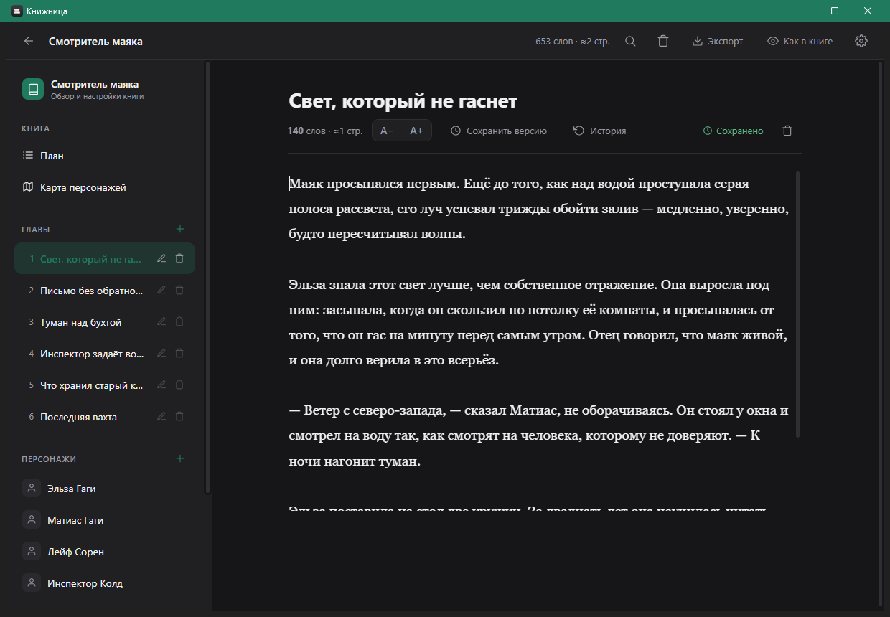

# Книжница

Книжница is a local-first Windows desktop app for writers. It helps keep books,
chapters, characters, plans, search, trash, backups, and exports in one quiet
workspace.

Приложение работает без облака, без аккаунтов и без обязательного интернета. Все
рукописи хранятся только на компьютере пользователя.



## Что делает приложение

- ведет несколько книг в одной локальной библиотеке;
- хранит главы с автосохранением и историей версий;
- помогает вести персонажей, связи, заметки и план по главам;
- ищет по книгам, главам, персонажам, связям и плану;
- отправляет удаленные книги, главы, персонажей и заметки в корзину;
- делает локальные резервные копии;
- экспортирует книгу в `.docx` и `.txt`.

## Где хранятся данные

Основная библиотека хранится здесь:

```text
%APPDATA%\Книжница\library.json
```

Резервные копии хранятся рядом:

```text
%APPDATA%\Книжница\Резервные копии
```

Книжница не загружает рукописи на сервер. Если вы публикуете issue или pull
request, не прикладывайте реальные рукописи, личные данные и приватные файлы.

## Установка

1. Откройте [Releases](../../releases) и скачайте `Knizhnitsa-Setup.exe`.
2. Запустите установщик.
3. После установки Книжница появится в меню Пуск и на рабочем столе.

Установка идет для текущего пользователя и не требует пароля администратора.
Книги при удалении приложения не трогаются, потому что лежат в
`%APPDATA%\Книжница`.

Пока установщик не подписан сертификатом, Windows может показать предупреждение
SmartScreen. Для нового небольшого open-source приложения это ожидаемо: исходный
код и сборочные файлы лежат в этом репозитории.

## Разработка

Требуется Windows, Python 3, зависимости из `app/requirements.txt` и, для сборки
установщика, Inno Setup 6.

```powershell
cd app
python -m pip install -r requirements.txt
python main.py
```

Сборка приложения:

```powershell
cd app
python -m PyInstaller --noconfirm --clean .\Книжница.spec
```

Готовая программа появится здесь:

```text
app\dist\Книжница\Книжница.exe
```

Сборка установщика:

```powershell
cd app
& "$env:LOCALAPPDATA\Programs\Inno Setup 6\ISCC.exe" installer.iss
```

Готовый установщик появится здесь:

```text
app\dist\installer\Книжница-Setup.exe
```

## Проверка изменений

Автоматических тестов пока нет. Перед выпуском изменения проверяются вручную по
чеклисту:

- запуск приложения;
- создание и редактирование книги;
- главы, автосохранение и история версий;
- персонажи, связи, план, поиск и корзина;
- экспорт в Word и TXT;
- резервные копии;
- установка и обновление через установщик;
- сохранность пользовательских данных при обновлении и удалении.

Подробный список: [docs/RELEASE_CHECKLIST.md](docs/RELEASE_CHECKLIST.md).

## Why open source? / Почему это открыто

Книжница работает с самым личным материалом писателя: черновиками, идеями и
рукописями. Поэтому проект открыт, чтобы любой мог проверить, где хранятся
данные, как создаются резервные копии, как работает экспорт и что делает
установщик.

Открытый код также помогает аккуратно развивать приложение: фиксировать проблемы
в issues, обсуждать изменения до выпуска и постепенно добавлять тесты для
важных частей.

## Maintainer workflow

Перед релизом maintainer делает короткую проверку:

1. Обновить код и документацию, если поведение изменилось.
2. Запустить приложение локально из `app/main.py`.
3. Пройти ручной чеклист релиза.
4. Собрать приложение через PyInstaller.
5. Собрать установщик через Inno Setup.
6. Установить новую версию поверх старой и проверить, что данные в
   `%APPDATA%\Книжница` сохранились.
7. Создать GitHub release с установщиком и понятными заметками.

План сопровождения лежит в [docs/ROADMAP.md](docs/ROADMAP.md).

## Безопасность

Если вы нашли проблему, сначала прочитайте [SECURITY.md](SECURITY.md). Не
публикуйте в открытых issues реальные рукописи, личные данные, файлы библиотеки
или резервные копии.

## Лицензия

MIT License. См. [LICENSE](LICENSE).
